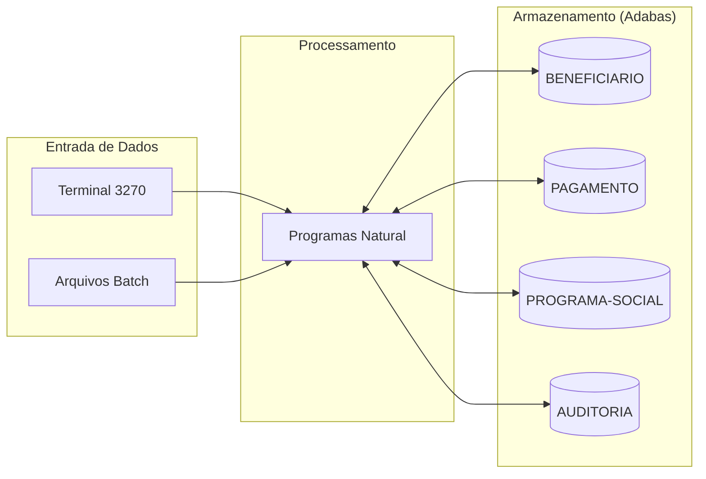

<!-- markdownlint-disable MD013 MD025 MD026 MD028 MD029 MD034 MD040 MD051 MD060 -->

# Mapa de Dependências — SIFAP Legado

  

> 🗺 **Você está aqui:** [Kit PT-BR](../README.md) → [Estágio 1](README.md) → **dependency-map**

> **Para quem é isto?** Este é um **artefato preenchido pelo time** durante o Estágio 1 (Arqueologia).
>
> **O que você terá ao final do estágio:**
>
> 1. Este documento totalmente preenchido com os dados reais do legado SIFAP
> 2. Rastreabilidade para `01-arqueologia/legado-sifap/` (programas `.NSN` e DDMs)
> 3. Base de evidência usada nas EARS do Estágio 2 (`source_legacy:`)
>
> 📘 **Guia passo a passo:** [`GUIDE.md`](GUIDE.md).

> Use diagramas Mermaid para mapear as dependências entre programas Natural e DDMs Adabas.
> O objetivo é visualizar "quem chama quem" e "quem lê/escreve o quê".

## Como descobrir dependências

- Use `grep` ou Copilot Chat para listar todas as ocorrências de `CALLNAT` nos 15 arquivos `.NSN`.
- Prompt útil: _"Liste todas as ocorrências de CALLNAT nestes arquivos e desenhe um diagrama Mermaid."_
- Para leitura/escrita em DDMs: procure por `READ`, `READ LOGICAL`, `STORE`, `UPDATE`, `DELETE`.

## Diagrama de Dependências entre Programas

> Cobre os **15 programas** `.NSN` e os **4 DDMs**. Arestas `CALLNAT` baseadas na documentação do legado (`legacy-docs/REGRAS-NEGOCIO-2012.md` §5.1 confirma BATCHPGT → CALCBENF e CALCDSCT; `GUIDE.md` acrescenta VALELEG/CALCCORR). Faixas de linha exatas das chamadas devem ser confirmadas na leitura detalhada antes de virarem `source_legacy:`.

```mermaid
flowchart TD
 subgraph "Programas Online (3270)"
 CADBENF["CADBENF.NSN<br/>Cadastro de Beneficiários"]
 CADDEPEND["CADDEPEND.NSN<br/>Cadastro de Dependentes"]
 CADPROG["CADPROG.NSN<br/>Cadastro de Programas"]
 CONSBENF["CONSBENF.NSN<br/>Consulta de Beneficiários"]
 end

 subgraph "Programas Batch"
 BATCHPGT["BATCHPGT.NSN<br/>Processamento Mensal"]
 BATCHCON["BATCHCON.NSN<br/>Conciliação CNAB 240"]
 BATCHREL["BATCHREL.NSN<br/>Relatório Consolidado"]
 end

 subgraph "Subprogramas de Cálculo"
 CALCBENF["CALCBENF.NSN<br/>Cálculo do Benefício"]
 CALCCORR["CALCCORR.NSN<br/>Correção IPCA"]
 CALCDSCT["CALCDSCT.NSN<br/>Cálculo de Descontos"]
 end

 subgraph "Subprogramas de Validação"
 VALBENEF["VALBENEF.NSN<br/>Validação Cadastral"]
 VALDOCS["VALDOCS.NSN<br/>Validação de Documentos"]
 VALELEG["VALELEG.NSN<br/>Validação de Elegibilidade"]
 end

 subgraph "Relatórios"
 RELPGT["RELPGT.NSN<br/>Relatório de Pagamentos"]
 RELAUDIT["RELAUDIT.NSN<br/>Relatório de Auditoria"]
 end

 subgraph "DDMs Adabas"
 DDM_BENEF[("BENEFICIARIO (150)")]
 DDM_PROG[("PROGRAMA-SOCIAL (151)")]
 DDM_PGTO[("PAGAMENTO (152)")]
 DDM_AUD[("AUDITORIA (153)")]
 end

 %% Cadastro online
 CADBENF -->|CALLNAT| VALBENEF
 CADBENF -->|CALLNAT| VALDOCS
 CADBENF -->|READ/STORE/UPDATE| DDM_BENEF
 CADDEPEND -->|READ/STORE/UPDATE| DDM_BENEF
 CADPROG -->|READ/STORE/UPDATE| DDM_PROG
 CONSBENF -->|READ| DDM_BENEF
 CONSBENF -->|READ| DDM_PGTO

 %% Validações
 VALBENEF -->|READ| DDM_BENEF
 VALDOCS -->|READ| DDM_BENEF
 VALELEG -->|READ| DDM_BENEF
 VALELEG -->|READ| DDM_PROG

 %% Cálculos
 CALCBENF -->|READ| DDM_BENEF
 CALCBENF -->|READ| DDM_PROG
 CALCBENF -->|STORE| DDM_PGTO
 CALCCORR -->|READ/UPDATE| DDM_PGTO
 CALCDSCT -->|READ| DDM_BENEF
 CALCDSCT -->|READ/UPDATE| DDM_PGTO

 %% Batch mensal
 BATCHPGT -->|CALLNAT| VALELEG
 BATCHPGT -->|CALLNAT| CALCBENF
 BATCHPGT -->|CALLNAT| CALCDSCT
 BATCHPGT -.->|CALLNAT?| CALCCORR
 BATCHPGT -->|READ| DDM_BENEF
 BATCHPGT -->|READ| DDM_PROG
 BATCHPGT -->|STORE| DDM_PGTO

 %% Conciliação e relatórios batch
 BATCHCON -->|READ/UPDATE| DDM_PGTO
 BATCHCON -->|STORE| DDM_AUD
 BATCHREL -->|READ| DDM_PGTO
 BATCHREL -->|READ| DDM_BENEF

 %% Relatórios online/on-demand
 RELPGT -->|READ| DDM_PGTO
 RELPGT -->|READ| DDM_BENEF
 RELAUDIT -->|READ| DDM_AUD
```

> **Legenda:** seta sólida `CALLNAT` = chamada de subprograma; seta tracejada `CALLNAT?` = chamada não confirmada (ver órfãos); arestas para cilindros = acesso a dados (READ/STORE/UPDATE).

## Diagrama de Fluxo de Dados (DDMs)

> Substitua "DDM 3: ???" e "DDM 4: ???" pelos nomes reais encontrados em [`../01-arqueologia/legado-sifap/adabas-ddms/`](../01-arqueologia/legado-sifap/adabas-ddms/).

## Tabela de Dependências

| Programa     | Chama (CALLNAT) | Lê (READ) DDMs | Escreve (STORE/UPDATE) DDMs | Observações |
| ------------ | --------------- | -------------- | --------------------------- | ----------- |
| CADBENF.NSN  | VALBENEF, VALDOCS | BENEFICIARIO | BENEFICIARIO | Cadastro online; valida antes de gravar. |
| CADDEPEND.NSN | — | BENEFICIARIO | BENEFICIARIO (PE DEPENDENTES) | Limita dependentes (PE). |
| CADPROG.NSN  | — | PROGRAMA-SOCIAL | PROGRAMA-SOCIAL | Aplica FATOR-K. |
| CONSBENF.NSN | — | BENEFICIARIO, PAGAMENTO | — | Consulta online; mascara CPF. |
| CALCBENF.NSN | — | BENEFICIARIO, PROGRAMA-SOCIAL | PAGAMENTO | Núcleo de cálculo; ~4.800 linhas. |
| CALCCORR.NSN | — | PAGAMENTO | PAGAMENTO | Sem chamador confirmado (ver órfãos). |
| CALCDSCT.NSN | — | BENEFICIARIO, PAGAMENTO | PAGAMENTO | Aplica descontos/teto 30%. |
| VALBENEF.NSN | — | BENEFICIARIO | — | Subprograma de validação. |
| VALDOCS.NSN  | — | BENEFICIARIO | — | Subprograma de validação. |
| VALELEG.NSN  | — | BENEFICIARIO, PROGRAMA-SOCIAL | — | Subprograma de elegibilidade. |
| BATCHPGT.NSN | VALELEG, CALCBENF, CALCDSCT, (CALCCORR?) | BENEFICIARIO, PROGRAMA-SOCIAL | PAGAMENTO | Entry point mensal; ordenação por descritor. |
| BATCHCON.NSN | — | PAGAMENTO | PAGAMENTO, AUDITORIA | Conciliação CNAB 240. |
| BATCHREL.NSN | — | PAGAMENTO, BENEFICIARIO | — | Relatório consolidado por região. |
| RELPGT.NSN   | — | PAGAMENTO, BENEFICIARIO | — | Relatório analítico de pagamentos. |
| RELAUDIT.NSN | — | AUDITORIA | — | Filtra exclusões (EX). |
|              |                 |                |                             |             |
|              |                 |                |                             |             |
|              |                 |                |                             |             |
|              |                 |                |                             |             |

## Dependências Circulares

> Liste aqui qualquer dependência circular encontrada (programa A chama B que chama A):

- Nenhuma encontrada. As chamadas fluem de forma acíclica (online/batch → validação/cálculo → DDMs).

## Programas Órfãos

> Programas que não são chamados por nenhum outro (possíveis pontos de entrada ou código morto):

- **Entry points (esperado serem órfãos de chamada):** `BATCHPGT.NSN`, `BATCHCON.NSN`, `BATCHREL.NSN` (jobs batch) e os programas online `CADBENF`, `CADDEPEND`, `CADPROG`, `CONSBENF`, `RELPGT`, `RELAUDIT` (acionados por terminal/scheduler, não por CALLNAT).
- **Órfão real a investigar:** `CALCCORR.NSN` — calcula correção retroativa por IPCA, mas **nenhum `CALLNAT CALCCORR` foi confirmado** em outro programa. `GUIDE.md` sugere que `BATCHPGT` o chamaria, mas a leitura inicial não confirmou. Possível acionamento manual ou job não identificado. **Ver `mysteries-found.md`.**

---

### Continuar a leitura

<table width="100%">
<tr>
<td width="50%" valign="top" align="left">
<strong>← ANTERIOR</strong> 
<a href="business-rules-catalog.md"><strong>business-rules-catalog.md</strong></a> 
Catálogo de regras.
</td>
<td width="50%" valign="top" align="right">
<strong>PRÓXIMO →</strong> 
<a href="discovery-report.md"><strong>discovery-report.md</strong></a> 
Síntese final.
</td>
</tr>
</table>

↑ <a href="README.md">Voltar ao Kit PT-BR</a>

