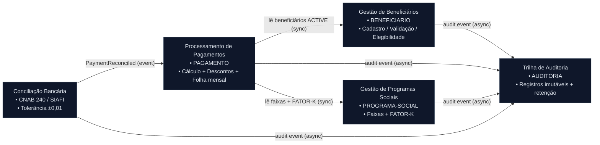

<!-- markdownlint-disable MD013 MD025 MD026 MD028 MD029 MD034 MD040 MD051 MD060 -->

# Mapa de Bounded Contexts — SIFAP 2.0

> 🗺 **Você está aqui:** [Kit PT-BR](../README.md) → [Estágio 2](README.md) → **Bounded Contexts**

**Time**: Equipe SIFAP
**Data**: 2026-06-10
**Gerado por**: `/carve-bounded-contexts` (agente `@architect`)
**Input**: [`01-arqueologia/discovery-report.md`](../01-arqueologia/discovery-report.md), [`business-rules-catalog.md`](../01-arqueologia/business-rules-catalog.md), [`dependency-map.md`](../01-arqueologia/dependency-map.md)

> [!IMPORTANT]
> Este documento apresenta **recomendações**, não decisões finais. Fronteiras de bounded
> context são decisões estratégicas que afetam estrutura de time, contratos de API e
> evolução do sistema. A decisão final é do time, **especialmente do Product Owner (Par 1)**,
> que conhece as fronteiras de negócio melhor que o código.

---

## Critérios de Avaliação

Cada hipótese de recorte foi avaliada contra três critérios:

| Critério | Pergunta | O que é bom |
| --- | --- | --- |
| **Coesão** | As regras deste grupo pertencem à mesma capacidade de negócio? | **Alta** = candidato forte |
| **Acoplamento** | Quantas dependências cruzam esta fronteira? (ver `dependency-map.md`) | **Baixo** = candidato forte |
| **Frequência de mudança** | No legado, estes programas mudavam juntos? | Mudar junto = mesmo contexto |

Lembrete: isto é um **Modular Monolith**. A comunicação entre contextos é **in-process** (chamada de método via interface ou domain event), nunca HTTP entre serviços.

---

## Avaliação de Hipóteses

### Hipótese 1: Gestão de Beneficiários — ACEITA ✅

Conteria: `CADBENEF`, `CADDEPEND`, `VALBENEF`, `VALDOCS`, `VALELEG`, `CONSBENF` + DDM `BENEFICIARIO`.

| Critério | Avaliação | Evidência |
| --- | --- | --- |
| Coesão | **ALTA** | Família com radical `BENEF` gira em torno do DDM BENEFICIARIO; cadastro + validação + consulta da mesma entidade central. |
| Acoplamento | **MÉDIO** | É lido por Pagamento (status ACTIVE) e por elegibilidade, mas escreve apenas em BENEFICIARIO. Leitura, não escrita cruzada. |
| Frequência de mudança | **BAIXA** | Cadastro/validação estável; muda por mudança regulatória de documentação, não no ciclo financeiro. |

**Recomendação:** ACEITAR. Entidade central que alimenta todo o cálculo e a elegibilidade.

### Hipótese 2: Processamento de Pagamentos — ACEITA ✅

Conteria: `BATCHPGT`, `CALCBENF`, `CALCCORR`, `CALCDSCT` + DDM `PAGAMENTO`.

| Critério | Avaliação | Evidência |
| --- | --- | --- |
| Coesão | **ALTA** | Núcleo financeiro: cálculo do benefício (BR-003), descontos (BR-001) e geração da folha mensal (BR-016) na mesma capacidade. |
| Acoplamento | **MÉDIO-ALTO** | `BATCHPGT` é o nó mais conectado: lê BENEFICIARIO e PROGRAMA-SOCIAL e chama VALELEG/CALCBENF/CALCDSCT. Acoplamento é de **leitura** de dados de referência. |
| Frequência de mudança | **ALTA** | Concentra 9 regras críticas; qualquer mudança no cálculo cascateia na folha. Deve ficar isolado para conter o blast radius. |

**Recomendação:** ACEITAR. É o coração financeiro do sistema e a prioridade 1 de migração (§5.1 do discovery-report).

### Hipótese 3: Gestão de Programas Sociais — ACEITA ✅

Conteria: `CADPROG` + DDM `PROGRAMA-SOCIAL`.

| Critério | Avaliação | Evidência |
| --- | --- | --- |
| Coesão | **ALTA** | Parâmetros de elegibilidade, faixas de valores e o `FATOR-K` (BR-008) são autocontidos no cadastro de programa. |
| Acoplamento | **BAIXO** | Apenas ~45 registros parametrizados, lidos por Pagamento e Beneficiários. Não escreve em outros contextos. |
| Frequência de mudança | **BAIXA / INDEPENDENTE** | Programas e faixas mudam por exercício/normativa (anual), não no ciclo mensal. |

**Recomendação:** ACEITAR. Contexto pequeno hoje, mas é o **dono dos parâmetros de cálculo** (incl. o FATOR-K do MYS-001). Tende a crescer com novos programas e faixas; merece fronteira própria em vez de ser absorvido por Pagamentos.

### Hipótese 4: Conciliação Bancária — ACEITA ✅

Conteria: `BATCHCON` + integração CNAB 240 / SIAFI.

| Critério | Avaliação | Evidência |
| --- | --- | --- |
| Coesão | **ALTA** | Conciliação do retorno bancário CNAB 240, tolerância ±0,01 e mapeamento de códigos de retorno (BR-017) formam uma capacidade fechada. |
| Acoplamento | **BAIXO-MÉDIO** | Atualiza o status de PAGAMENTO e integra com sistema externo (banco/SIAFI). Acoplamento concentrado em uma transição de estado. |
| Frequência de mudança | **MÉDIA** | Muda quando o layout bancário ou a integração externa muda — ciclo independente do cálculo. |

**Recomendação:** ACEITAR. Fecha o ciclo financeiro e isola a integração externa (CNAB/SIAFI) atrás de uma fronteira clara.

### Hipótese 5: Trilha de Auditoria — ACEITA ✅

Conteria: DDM `AUDITORIA`, `RELAUDIT` + regras de retenção (IN-TCU 63/2010).

| Critério | Avaliação | Evidência |
| --- | --- | --- |
| Coesão | **ALTA** | Registros imutáveis, perfis (ADM/OPR/CON/AUD/SUP) e retenção regulatória estão fortemente relacionados. |
| Acoplamento | **BAIXO** | Outros contextos **publicam** eventos para a Auditoria, mas não dependem dela. Sem acoplamento de saída. |
| Frequência de mudança | **INDEPENDENTE** | Requisitos de auditoria mudam em ciclos regulatórios (TCU/CGU), não em ciclos de negócio. |

**Recomendação:** ACEITAR. Subdomínio de suporte com motivadores regulatórios próprios.

### Hipótese Rejeitada: "Processamento Batch" — REJEITADA ❌

Agruparia `BATCHPGT`, `BATCHREL`, `BATCHCON` por serem jobs batch.

| Critério | Avaliação | Evidência |
| --- | --- | --- |
| Coesão | **BAIXA** | Agrupa por *como* executa (batch), não por *o que* faz. Pagamento e conciliação são domínios distintos. |
| Acoplamento | **MUITO ALTO** | Toda regra de negócio rodaria dentro do loop batch. |

**Recomendação:** REJEITAR. Batch é um **modo de execução** (infraestrutura), não um conceito de domínio. As regras vão para Pagamentos e Conciliação; o agendamento é uma preocupação transversal.

### Hipótese Rejeitada: "Relatórios" — REJEITADA ❌

Agruparia `RELPGT`, `RELAUDIT`, `BATCHREL`.

| Critério | Avaliação | Evidência |
| --- | --- | --- |
| Coesão | **BAIXA** | "Relatórios" é uma preocupação transversal, não um domínio. |
| Acoplamento | **MUITO ALTO** | Todos os contextos produzem dados que alimentam relatórios. |

**Recomendação:** REJEITAR. Relatórios são **read models** por contexto: `RELPGT` vira leitura de Pagamentos; `RELAUDIT` vira leitura de Auditoria.

---

## Bounded Contexts Finais

### Gestão de Beneficiários (Beneficiary Management)

- **Responsabilidade:** Mantém o cadastro de beneficiários e dependentes, valida documentação (VALDOCS), elegibilidade (VALELEG) e dados cadastrais (VALBENEF, CPF módulo 11), e gerencia o ciclo de vida do status (A/S/C/I/D). É a fonte da verdade sobre *quem* é elegível.
- **Dados próprios (DDMs/tabelas):** `BENEFICIARIO` (FNR 150, ~4,2M registros) e dependentes.
- **Interface pública:** `findActiveBeneficiaries()`, `getBeneficiary(id)`, `checkEligibility(beneficiaryId, programId)`, `registerBeneficiary(cmd)`. Expõe somente IDs e DTOs read-only para outros contextos.
- **Por que é seu próprio contexto:** Alta coesão em torno de uma entidade central com baixa frequência de mudança; é a raiz de elegibilidade consumida por Pagamentos.

### Processamento de Pagamentos (Payment Processing)

- **Responsabilidade:** Calcula o valor do benefício por programa/faixa (BR-003, CALCBENF), aplica correções/reajustes (CALCCORR), calcula descontos com teto de 30% para não judiciais (BR-001, CALCDSCT) e gera a folha mensal processando apenas beneficiários ACTIVE na ordenação do descritor (BR-016, BATCHPGT).
- **Dados próprios (DDMs/tabelas):** `PAGAMENTO` (FNR, ~180M registros).
- **Interface pública:** `generateMonthlyCycle(period)`, `calculateBenefit(beneficiaryId, programId)`, `getPayment(id)`. Publica eventos `PaymentCreated`, `PaymentCalculated`.
- **Por que é seu próprio contexto:** Concentra as 9 regras críticas e a maior frequência de mudança; isolar contém o blast radius do núcleo financeiro.

### Gestão de Programas Sociais (Social Program Management)

- **Responsabilidade:** Mantém os programas sociais, suas faixas de valores por exercício, parâmetros de elegibilidade e o `FATOR-K = 1 + (FATOR-REAJ × 0.347215)` (BR-008, CADPROG). É o **dono dos parâmetros de cálculo**.
- **Dados próprios (DDMs/tabelas):** `PROGRAMA-SOCIAL` (FNR 151, ~45 registros parametrizados, com campos MU/PE).
- **Interface pública:** `getProgram(id)`, `getValueRange(programId, exercise)`, `getCalculationParameters(programId)`. Expõe parâmetros read-only.
- **Por que é seu próprio contexto:** Alta coesão e baixo acoplamento; parâmetros mudam por normativa (anual), em ciclo independente do cálculo mensal.

> ⚠️ **Open question herdada do Estágio 1:** a origem da constante `0.347215` (MYS-001) permanece sem documentação. Este contexto é o dono dessa regra — resolver antes de escrever as EARS de cálculo.

### Conciliação Bancária (Bank Reconciliation)

- **Responsabilidade:** Concilia o retorno bancário no layout CNAB 240 com tolerância de ±0,01, mapeia códigos de retorno e atualiza o status final do pagamento (BR-017, BATCHCON). Isola a integração externa com banco e SIAFI.
- **Dados próprios (DDMs/tabelas):** Registros de remessa/retorno e mapa de códigos de retorno. Atualiza status em `PAGAMENTO` via interface de Pagamentos (não escreve direto).
- **Interface pública:** `reconcile(returnFile)`, `getReconciliationStatus(paymentId)`. Consome arquivos CNAB; publica evento `PaymentReconciled`.
- **Por que é seu próprio contexto:** Capacidade fechada de integração externa, com ciclo de mudança próprio (layout bancário) e baixo acoplamento.

### Trilha de Auditoria (Audit Trail)

- **Responsabilidade:** Grava registros imutáveis de toda alteração de entidade (estado anterior/posterior), aplica políticas de retenção regulatória (IN-TCU 63/2010) e expõe consultas de auditoria por perfil (ADM/OPR/CON/AUD/SUP). Inclui o relatório de auditoria (RELAUDIT).
- **Dados próprios (DDMs/tabelas):** `AUDITORIA` (FNR, ~25M registros), campo `COD-PERFIL`.
- **Interface pública:** `recordAuditEvent(event)` (consumidor de eventos), `queryAuditTrail(filters)`. Nunca expõe escrita arbitrária; somente append.
- **Por que é seu próprio contexto:** Subdomínio de suporte regulatório; recebe eventos de todos os contextos sem que eles dependam dele.

---

## Comunicação Inter-Context

Toda comunicação é **in-process** (Modular Monolith). Consultas de dados de referência são síncronas; auditoria é assíncrona (fire-and-forget).

| De | Para | Direção | Mecanismo | Dados trocados |
| --- | --- | --- | --- | --- |
| Processamento de Pagamentos | Gestão de Beneficiários | A → B | Chamada de método via interface (read-only) | `beneficiaryId` + status (ACTIVE) + dados de cálculo |
| Processamento de Pagamentos | Gestão de Programas Sociais | A → B | Chamada de método via interface (read-only) | `programId` → faixas de valor + parâmetros (FATOR-K) |
| Conciliação Bancária | Processamento de Pagamentos | A → B | Domain event + método de transição de estado | `PaymentReconciled` (paymentId, status, código de retorno) |
| Gestão de Beneficiários | Trilha de Auditoria | A → B | Domain event assíncrono | Evento de auditoria (entidade, antes/depois, autor) |
| Processamento de Pagamentos | Trilha de Auditoria | A → B | Domain event assíncrono | Evento de auditoria (entidade, antes/depois, autor) |
| Gestão de Programas Sociais | Trilha de Auditoria | A → B | Domain event assíncrono | Evento de auditoria (entidade, antes/depois, autor) |
| Conciliação Bancária | Trilha de Auditoria | A → B | Domain event assíncrono | Evento de auditoria (entidade, antes/depois, autor) |

---

## Diagrama Mermaid do Mapa de Contexto

---

## Itens em Aberto para o Time / Product Owner

1. **Gestão de Programas Sociais como contexto próprio** — pequeno hoje (~45 registros). Confirmar se cresce (novos programas/faixas) ou se deve ser absorvido por Pagamentos. Recomendação: manter separado por ser dono dos parâmetros de cálculo.
2. **MYS-001 (FATOR-K `0.347215`)** e **MYS-002 (`CALCCORR` órfão)** bloqueiam as EARS de cálculo — resolver com facilitador antes do `/write-ears-spec`.
3. **MYS-003 (região 99 ignora elegibilidade)** — decidir em qual contexto a exceção de segurança é tratada (provável: Gestão de Beneficiários / elegibilidade).

---

**Definição de Pronto:** hipóteses avaliadas (5 + 2 rejeitadas), rejeições documentadas, 5 contextos nomeados em linguagem de negócio, caminhos de comunicação definidos, Mermaid renderiza. Próximo passo: `/generate-adr` e `/write-ears-spec`.

— Equipe SIFAP
