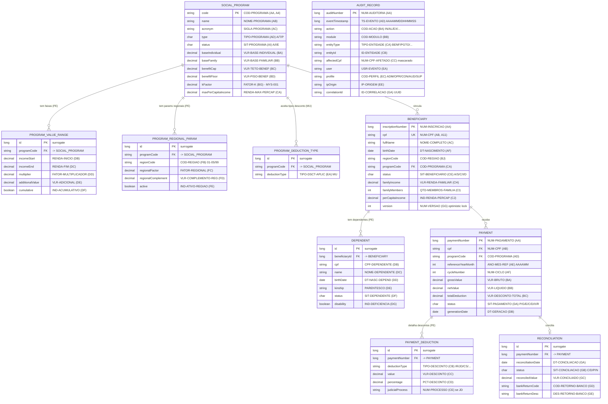

<!-- markdownlint-disable MD013 MD025 MD026 MD028 MD029 MD034 MD040 MD051 MD060 -->

# Rascunho do Modelo de Dados — SIFAP 2.0

> 🗺 **Você está aqui:** [Kit PT-BR](../README.md) → [Estágio 2](README.md) → **Modelo de Dados**

**Time**: Equipe SIFAP
**Data**: 2026-06-10
**Gerado por**: `@architect` (Estágio 2)
**Inputs**: [`bounded-contexts.md`](bounded-contexts.md), [`SPECIFICATION.md`](SPECIFICATION.md), [`ADRs/adr-002-adabas-mu-pe-mapping.md`](ADRs/adr-002-adabas-mu-pe-mapping.md), DDMs `01-arqueologia/legado-sifap/adabas-ddms/*.ddm`

> [!IMPORTANT]
> **Rascunho de design, não schema final.** Este é um esboço entity-relationship do Estágio 2.
> Tipos, índices e constraints finais são detalhados no Estágio 3 (migrations Flyway/Liquibase).
> Toda entidade rastreia para um DDM Adabas legado ou para um requisito `[GREENFIELD]`.

> [!NOTE]
> **Princípios de mapeamento** (ver [ADR-002](ADRs/adr-002-adabas-mu-pe-mapping.md)):
> grupos **PE** (periodic groups) → `@OneToMany` com entidade filha · campos **MU** (multiple value)
> → `@ElementCollection` ou tabela filha · super-descriptors → `@Index` composto ·
> valores financeiros → `BigDecimal`/`NUMERIC` (nunca `double`) · datas `AAAAMMDD` → `LocalDate`.

---

## Diagrama Entidade-Relacionamento (Mermaid)

> `AUDIT_RECORD` aparece sem aresta relacional porque é **append-only e desacoplado**: recebe
> domain events de todos os contextos (REQ-015) e não mantém FKs rígidas para as entidades de
> negócio — guarda `entityType` + `entityId` como referência fraca (ver
> [bounded-contexts.md](bounded-contexts.md), Trilha de Auditoria). O estado antes/depois
> (campos MU `CAMPO-ALTERADO-*` / `VALOR-*`) é persistido como JSONB (ver tabela abaixo).

---

## Mapeamento DDM Adabas → Entidade JPA

### Gestão de Programas Sociais — DDM `PROGRAMA-SOCIAL` (FNR 151, ~45 registros)

| Estrutura legada | Tipo Adabas | Entidade / atributo JPA | Estratégia de mapeamento |
| --- | --- | --- | --- |
| `COD-PROGRAMA` (AA, super-descriptor S1) | A4, DE | `SocialProgram.code` `@Id` | Chave de negócio (PK natural) |
| Campos escalares (AB–CI) | A/N | `SocialProgram.*` | Colunas diretas; `N x.y` → `BigDecimal` |
| `FATOR-K` (BG) | N 5.4 | `SocialProgram.kFactor` (`BigDecimal`) | ⚠️ valor da constante bloqueado por **MYS-001** (REQ-006) |
| `GRP-FAIXA-CALCULO` (DA–DF) | **PE** (max 5) | `ProgramValueRange` `@OneToMany` | Tabela filha `program_value_range` ([ADR-002](ADRs/adr-002-adabas-mu-pe-mapping.md)) |
| `GRP-PARAM-REGIONAL` (FA–FE) | **PE** (max 6) | `ProgramRegionalParam` `@OneToMany` | Tabela filha; `COD-REGIAO=99` é exceção (**MYS-003**) |
| `TIPO-DSCT-APLIC` (EA) | **MU** (max 8) | `programDeductionTypes` `@ElementCollection` | Tabela filha simples de strings |
| Super-descriptor S2 (`TIPO` + `SITUACAO`) | DE composto | `@Index` em `(type, status)` | Índice composto |

### Gestão de Beneficiários — DDM `BENEFICIARIO` (FNR 150, ~4,2M registros)

| Estrutura legada | Tipo Adabas | Entidade / atributo JPA | Estratégia de mapeamento |
| --- | --- | --- | --- |
| `NUM-INSCRICAO` (AA) | N11 | `Beneficiary.inscriptionNumber` `@Id` | Matrícula como PK |
| `NUM-CPF` (AB, super-descriptor S1) | A11, DE | `Beneficiary.cpf` `@Column(unique)` | Validado por módulo 11 (REQ-001); mascarado em logs (REQ-017) |
| `GRP-ENDERECO` (BA–BJ) | grupo | `Address` `@Embedded` | Value object embutido (mesma tabela) |
| `SIT-BENEFICIARIO` (CE) | A1 | `Beneficiary.status` `enum` | A/S/C/I/D; transições controladas (REQ-002) |
| `COD-PROGRAMA` (CA) | A4 | FK → `SocialProgram` | `@ManyToOne` (anti-corruption via `ProgramFacade`) |
| `GRP-DEPENDENTE` (DA–DG) | **PE** (max 10) | `Dependent` `@OneToMany` | Tabela filha `dependent` |
| `NUM-VERSAO` (GG) | N5 | `@Version` | Optimistic locking |
| Super-descriptors S2/S3 (`UF+SIT`, `PROG+SIT`) | DE composto | `@Index` compostos | Índices para consulta de elegibilidade |

### Processamento de Pagamentos — DDM `PAGAMENTO` (FNR 152, ~180M registros)

| Estrutura legada | Tipo Adabas | Entidade / atributo JPA | Estratégia de mapeamento |
| --- | --- | --- | --- |
| `NUM-PAGAMENTO` (AA) | N15, DE | `Payment.paymentNumber` `@Id` | Sequencial único |
| `VLR-BRUTO/LIQUIDO/DESCONTO-TOTAL` (BA–BC) | N9.2 / N7.2 | `BigDecimal` | Precisão financeira (BR-001/BR-003); política de arredondamento **MYS-005** |
| `GRP-DESCONTO` (CA–CG) | **PE** (max 8) | `PaymentDeduction` `@OneToMany` | Teto 30% não judicial / `JD` sem teto (REQ-009/010) |
| `SIT-PAGAMENTO` (DA) | A1 | `Payment.status` `enum` | P/G/E/C/D/X/R |
| `ANO-MES-REF` (AE) + `SIT` (super-descriptor S2) | DE composto | `@Index` em `(referenceYearMonth, status)` | Suporte ao ciclo mensal (REQ-011/012) |
| Campos SIAFI (FA–FE) e dados bancários (EA–EE) | A | `Payment.*` ou `@Embedded BankData` | Detalhe no Estágio 3 |
| `DT-CONCILIACAO`..`DES-RETORNO-BANCO` (GA–GE) | A/N | Entidade `Reconciliation` | Extraída para o contexto Conciliação Bancária |

> **Particionamento (Estágio 3):** com ~180M registros e crescimento de ~3,8M/mês, `payment`
> é forte candidato a particionamento por `referenceYearMonth` (range partitioning no PostgreSQL).
> Decisão a registrar em ADR próprio quando o volume for confirmado.

### Trilha de Auditoria — DDM `AUDITORIA` (FNR 153, ~25M registros)

| Estrutura legada | Tipo Adabas | Entidade / atributo JPA | Estratégia de mapeamento |
| --- | --- | --- | --- |
| `NUM-AUDITORIA` (AA) | N15, DE | `AuditRecord.auditNumber` `@Id` | Sequencial único |
| `TS-EVENTO` (AD) | N14 | `AuditRecord.eventTimestamp` (`Instant` UTC) | Timestamp com precisão (REQ-015) |
| `GRP-ANTES` / `GRP-DEPOIS` (campos MU `CAMPO-*`/`VALOR-*`) | **MU** (max 20) | `beforeState` / `afterState` JSONB | Estado antes/depois como documento (REQ-015) |
| `COD-PERFIL` (EC) | A3 | `AuditRecord.profile` `enum` | RBAC: ADM/OPR/CON/AUD/SUP ([ADR-003](ADRs/adr-003-authentication-authorization.md)) |
| `NUM-CPF-AFETADO` (CC) | A11 | `AuditRecord.affectedCpf` (mascarado) | Mascaramento LGPD (REQ-017) |
| Super-descriptor S2 (`ENTIDADE+DATA`) | DE composto | `@Index` em `(entityType, entityId, eventTimestamp)` | Consulta da trilha (REQ-015) |
| (registro inteiro) | — | **Imutável** | Sem UPDATE/DELETE (REQ-016) — enforce via trigger + revogação de grant |

> ⚠️ **MYS-007 herdado do Estágio 1:** o legado oculta ações `EX` (exclusão) na exibição
> (`RELAUDIT.NSN` filtra), embora os registros existam. No modelo novo, a imutabilidade
> (REQ-016) torna toda ação visível — confirmar com compliance se há impacto regulatório.

---

## Decisões de Modelagem (resumo)

| # | Decisão | Justificativa | Rastreabilidade |
| --- | --- | --- | --- |
| 1 | Grupos PE → `@OneToMany` (não JSONB) | Consulta por exercício/faixa com índice; precisão financeira | [ADR-002](ADRs/adr-002-adabas-mu-pe-mapping.md), REQ-005/007 |
| 2 | Campos MU simples → `@ElementCollection` | Listas curtas sem identidade própria (tipos de desconto) | ADR-002, DDM PROGRAMA-SOCIAL |
| 3 | Estado antes/depois da auditoria → JSONB | Estrutura variável (até 20 campos MU); não é consultado por campo | REQ-015, DDM AUDITORIA |
| 4 | `Reconciliation` extraída de `PAGAMENTO` | Isola a integração externa (CNAB/SIAFI) no seu bounded context | [bounded-contexts.md](bounded-contexts.md), REQ-013/014 |
| 5 | Valores financeiros sempre `BigDecimal`/`NUMERIC` | Evitar erro de `double`; alinhar truncamento/arredondamento | BR-001/003, **MYS-005** |
| 6 | `AUDIT_RECORD` sem FK rígida | Append-only desacoplado; referência fraca `entityType`+`entityId` | REQ-015/016 |

---

## Open Questions que Afetam o Schema

| MYS-ID | Impacto no modelo de dados | Bloqueia |
| --- | --- | --- |
| MYS-001 | Valor da constante `FATOR-K` (`SocialProgram.kFactor`) sem origem documentada | REQ-006 |
| MYS-003 | `COD-REGIAO=99` em `ProgramRegionalParam`/`Beneficiary` — exceção a documentar ou remover | REQ-003 |
| MYS-005 | Política de arredondamento (truncar vs. arredondar) afeta tipos/precisão de todos os valores | REQ-007/013 |
| MYS-007 | Ações `EX` ocultadas no legado — imutabilidade as expõe; confirmar impacto regulatório | REQ-015/016 |

---

**Definição de Pronto:** diagrama ER em Mermaid (`erDiagram`) com as 9 entidades principais ✅,
mapeamento DDM Adabas → JPA por bounded context (4 DDMs) ✅, estratégias PE/MU/super-descriptor
explícitas e alinhadas ao [ADR-002](ADRs/adr-002-adabas-mu-pe-mapping.md) ✅, rastreabilidade a
REQ-IDs e mistérios abertos ✅.

> Próximo passo: `/speckit.plan` consome este rascunho para gerar `data-model.md` detalhado +
> migrations no Estágio 3.

— Equipe SIFAP
