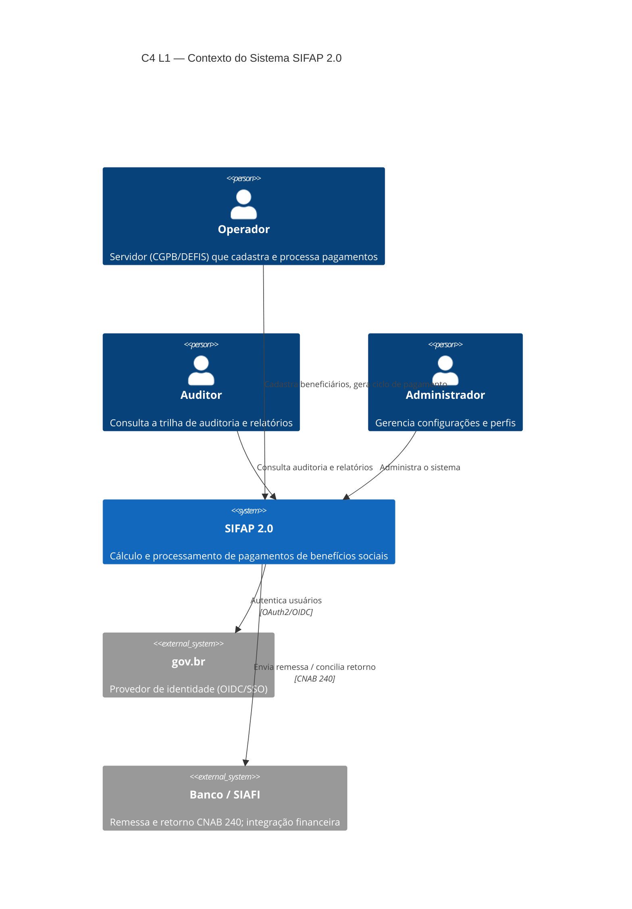
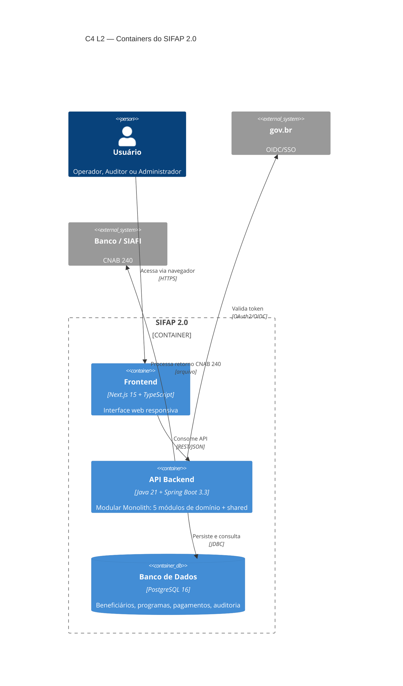
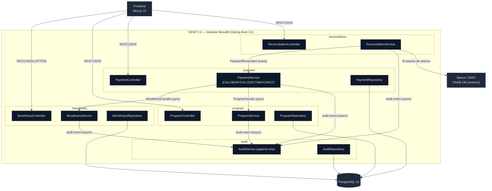

<!-- markdownlint-disable MD013 MD025 MD026 MD028 MD029 MD034 MD040 MD051 MD060 -->

# Design do Modular Monolith — SIFAP 2.0

> 🗺 **Você está aqui:** [Kit PT-BR](../README.md) → [Estágio 2](README.md) → **Modular Monolith Design**

**Time**: Equipe SIFAP
**Data**: 2026-06-10
**Gerado por**: `/design-modular-monolith` (agente `@architect`)
**Inputs**: [`bounded-contexts.md`](bounded-contexts.md), [`SPECIFICATION.md`](SPECIFICATION.md), [`ADRs/adr-001-modular-monolith-vs-microservices.md`](ADRs/adr-001-modular-monolith-vs-microservices.md)
**Base package**: `br.gov.serpro.sifap` *(ajuste se o time preferir outro — ver Itens em Aberto)*

> [!NOTE]
> Single deployable conforme [ADR-001](ADRs/adr-001-modular-monolith-vs-microservices.md). Toda comunicação cross-context é **in-process** (interface ou domain event), nunca HTTP entre serviços.

---

## Estrutura de Packages

Um package top-level por bounded context (package-by-feature). Somente `api/` e a interface pública exportada são visíveis a outros módulos; `domain/`, `service/` e `repository/` são internos.

```
br.gov.serpro.sifap/
├── beneficiary/                 # Gestão de Beneficiários
│   ├── api/                     # REST controllers (público)
│   ├── domain/                  # Beneficiary, Dependent, Status (interno)
│   ├── service/                 # Regras de cadastro/validação (interno)
│   ├── repository/              # Acesso a BENEFICIARIO (interno)
│   └── BeneficiaryFacade.java   # Interface pública exportada
├── program/                     # Gestão de Programas Sociais
│   ├── api/
│   ├── domain/                  # SocialProgram, ValueRange, KFactor (interno)
│   ├── service/
│   ├── repository/              # Acesso a PROGRAMA-SOCIAL (interno)
│   └── ProgramFacade.java
├── payment/                     # Processamento de Pagamentos
│   ├── api/
│   ├── domain/                  # Payment, Deduction, BenefitCalculation (interno)
│   ├── service/                 # CALCBENF/CALCDSCT/BATCHPGT (interno)
│   ├── repository/              # Acesso a PAGAMENTO (interno)
│   └── PaymentFacade.java
├── reconciliation/              # Conciliação Bancária
│   ├── api/
│   ├── domain/                  # ReturnFile, ReturnCode, ReconciliationResult
│   ├── service/                 # CNAB 240 / SIAFI (interno)
│   ├── repository/
│   └── ReconciliationFacade.java
├── audit/                       # Trilha de Auditoria
│   ├── api/
│   ├── domain/                  # AuditRecord (imutável)
│   ├── service/                 # Append-only, consultas por perfil
│   ├── repository/              # Acesso a AUDITORIA (interno)
│   └── AuditFacade.java
└── shared/                      # Kernel transversal
    ├── event/                   # DomainEvent, publisher in-process
    ├── exception/               # Exceções base, handlers
    ├── security/                # Masking de CPF/valores, perfis
    └── money/                   # Money/rounding (política de arredondamento)
```

A fronteira é imposta por **Spring Modulith** + testes **ArchUnit** no CI: nenhum módulo importa `domain/`, `service/` ou `repository/` de outro — apenas a `*Facade` pública.

---

## Interfaces de Módulo

DTOs que cruzam fronteira são **Java records**; retornos anuláveis usam `Optional`. Assinaturas (esqueleto — corpo no Estágio 3):

```java
// beneficiary/BeneficiaryFacade.java
public interface BeneficiaryFacade {
    Optional<BeneficiaryView> findById(BeneficiaryId id);          // REQ-001..004
    List<BeneficiaryId> findActive();                              // REQ-011
    EligibilityResult checkEligibility(BeneficiaryId id, ProgramId programId); // REQ-003
}
public record BeneficiaryView(BeneficiaryId id, String maskedCpf, BeneficiaryStatus status, int dependents) {}
public record EligibilityResult(boolean eligible, List<String> reasons) {}

// program/ProgramFacade.java
public interface ProgramFacade {
    Optional<ProgramView> findById(ProgramId id);                  // REQ-005
    Optional<ValueRange> getValueRange(ProgramId id, int exercise);// REQ-005
    KFactorParameters getCalculationParameters(ProgramId id);      // REQ-006 (bloqueado por MYS-001)
}
public record ValueRange(BigDecimal min, BigDecimal max) {}
public record KFactorParameters(BigDecimal adjustmentFactor, BigDecimal constantK) {}

// payment/PaymentFacade.java
public interface PaymentFacade {
    PaymentCycleSummary generateMonthlyCycle(YearMonth period);    // REQ-011, REQ-012
    BenefitAmount calculateBenefit(BeneficiaryId id, ProgramId programId); // REQ-007, REQ-008
    Optional<PaymentView> findById(PaymentId id);
    void applyReconciliationResult(PaymentId id, PaymentStatus status, String returnCode); // chamado por reconciliation
}
public record PaymentCycleSummary(YearMonth period, int created, int skipped) {}
public record BenefitAmount(BigDecimal gross, BigDecimal totalDeductions, BigDecimal net) {} // REQ-009, REQ-010

// reconciliation/ReconciliationFacade.java
public interface ReconciliationFacade {
    ReconciliationSummary reconcile(byte[] cnab240Return);         // REQ-013, REQ-014
    Optional<ReconciliationStatus> getStatus(PaymentId id);
}

// audit/AuditFacade.java
public interface AuditFacade {
    void record(AuditEvent event);                                 // REQ-015 (consumidor de eventos)
    List<AuditRecordView> query(AuditQuery filters);               // somente leitura, por perfil
}
```

---

## Comunicação Cross-Context

**Decisão (recomendada): comunicação MISTA** — chamadas de interface síncronas para leitura de dados de referência (baixa latência, consistência forte no cálculo) e domain events assíncronos para auditoria (desacoplamento). Alinha com [ADR-001](ADRs/adr-001-modular-monolith-vs-microservices.md) e a tabela de comunicação de [`bounded-contexts.md`](bounded-contexts.md).

| De | Para | Mecanismo | Dados |
| --- | --- | --- | --- |
| `payment` | `beneficiary` | Interface (`BeneficiaryFacade`) síncrona | `BeneficiaryId`, status, nº dependentes |
| `payment` | `program` | Interface (`ProgramFacade`) síncrona | `ProgramId` → `ValueRange`, `KFactorParameters` |
| `reconciliation` | `payment` | Domain event `PaymentReconciled` + `applyReconciliationResult(...)` | `PaymentId`, status, código de retorno |
| `beneficiary`/`payment`/`program`/`reconciliation` | `audit` | Domain event `*Changed` (assíncrono, fire-and-forget) | entidade, estado antes/depois, autor |

> Padrão alternativo considerado: **somente domain events** (acoplamento mais fraco). Rejeitado para as leituras síncronas do cálculo porque introduziria consistência eventual no núcleo financeiro — choca com MYS-005 e BR-017. **Time: confirmar a escolha mista.**

---

## Diagrama C4 — Nível 1 (System Context)



## Diagrama C4 — Nível 2 (Containers)



## Diagrama C4 — Nível 3 (Component)



---

## Resumo de Endpoints

Convenção: `/api/v1/{resource}`. Detalhes de schema no Estágio 3. Esqueleto completo em [`openapi.yaml`](openapi.yaml).

### beneficiary

| Método | Path | Resumo | Request | Response | REQ |
| --- | --- | --- | --- | --- | --- |
| POST | `/api/v1/beneficiaries` | Cadastra beneficiário (valida CPF módulo 11) | `BeneficiaryCreateRequest` | `BeneficiaryView` (201) | REQ-001 |
| PUT | `/api/v1/beneficiaries/{id}/status` | Altera status (bloqueia I→A direto) | `StatusChangeRequest` | `BeneficiaryView` (200/409) | REQ-002 |
| POST | `/api/v1/beneficiaries/{id}/eligibility` | Verifica elegibilidade num programa | `EligibilityRequest` | `EligibilityResult` | REQ-003 |
| POST | `/api/v1/beneficiaries/{id}/documents` | Valida documentação comprobatória | `DocumentsRequest` | `DocumentValidationResult` | REQ-004 |

### program

| Método | Path | Resumo | Request | Response | REQ |
| --- | --- | --- | --- | --- | --- |
| GET | `/api/v1/programs/{id}` | Consulta programa + faixas | — | `ProgramView` | REQ-005 |
| GET | `/api/v1/programs/{id}/value-range?exercise=` | Faixa de valor por exercício | — | `ValueRange` | REQ-005 |

### payment

| Método | Path | Resumo | Request | Response | REQ |
| --- | --- | --- | --- | --- | --- |
| POST | `/api/v1/payment-cycles` | Gera ciclo mensal (só ACTIVE, ordem do descritor) | `CycleRequest` | `PaymentCycleSummary` (201) | REQ-011, REQ-012 |
| POST | `/api/v1/payments/calculate` | Calcula benefício (base + dependente + descontos) | `CalculateRequest` | `BenefitAmount` | REQ-007..010 |
| GET | `/api/v1/payments/{id}` | Consulta pagamento | — | `PaymentView` | REQ-011 |

### reconciliation

| Método | Path | Resumo | Request | Response | REQ |
| --- | --- | --- | --- | --- | --- |
| POST | `/api/v1/reconciliations` | Processa retorno CNAB 240 (tolerância ±0,01) | `multipart/form-data` (arquivo) | `ReconciliationSummary` (201) | REQ-013, REQ-014 |
| GET | `/api/v1/reconciliations/{paymentId}` | Status de conciliação | — | `ReconciliationStatus` | REQ-013 |

### audit

| Método | Path | Resumo | Request | Response | REQ |
| --- | --- | --- | --- | --- | --- |
| GET | `/api/v1/audit-records` | Consulta trilha (somente leitura, por perfil) | query params | `AuditRecordView[]` | REQ-015 |

> Auditoria expõe **apenas GET**: REQ-016 (imutabilidade) proíbe UPDATE/DELETE — não há endpoints de escrita; registros entram por domain event.

---

## ADRs Relacionados

| ADR | Como afeta o design |
| --- | --- |
| [ADR-001 — Monolito Modular vs Microsserviços](ADRs/adr-001-modular-monolith-vs-microservices.md) | Define single deployable, comunicação in-process e enforcement de fronteira (Spring Modulith/ArchUnit). |
| [ADR-002 — Mapeamento Adabas MU/PE → JPA](ADRs/adr-002-adabas-mu-pe-mapping.md) | Define `program/domain`: faixas (PE) viram `@OneToMany ProgramValueRange`; campos MU viram `@ElementCollection`. |
| [ADR-003 — Autenticação/autorização](ADRs/adr-003-authentication-authorization.md) | Define `shared/security`: OIDC gov.br + RBAC dos perfis ADM/OPR/CON/AUD/SUP; proteção dos endpoints. |

---

## Itens em Aberto para o Time

1. **Base package** — `br.gov.serpro.sifap` é um default; confirmar o domínio oficial.
2. **Estilo de comunicação** — confirmar a escolha **mista** (interface síncrona + eventos de auditoria) vs. somente eventos.
3. **`program` como módulo próprio** — herdado de [`bounded-contexts.md`](bounded-contexts.md); manter separado (dono do FATOR-K) ou fundir em `payment`?
4. **Bloqueios de cálculo** — REQ-006 (MYS-001) e a política de arredondamento (MYS-005) precisam ser resolvidos; o módulo `shared/money` centraliza a regra de arredondamento quando definida.

---

**Definição de Pronto:** packages 1:1 com os 5 contextos ✅, interface pública por contexto ✅, comunicação cross-context especificada ✅, diagramas C4 L1 (Context) + L2 (Container) + L3 (Component) em Mermaid ✅, esqueleto OpenAPI com ≥1 endpoint por contexto ✅ ([`openapi.yaml`](openapi.yaml)), referências a ADRs e REQ-IDs ✅.

— Equipe SIFAP
